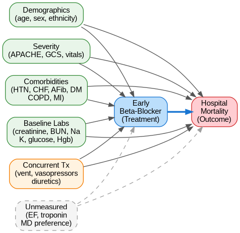
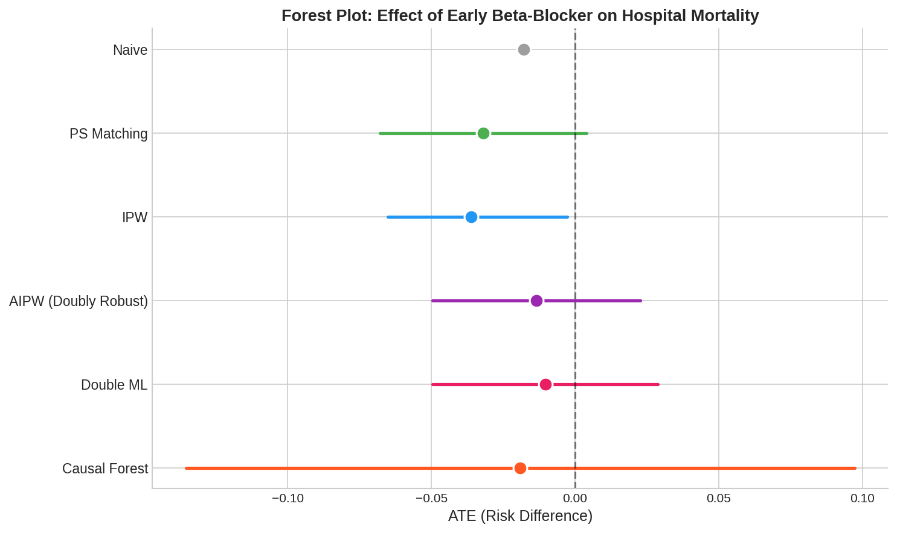
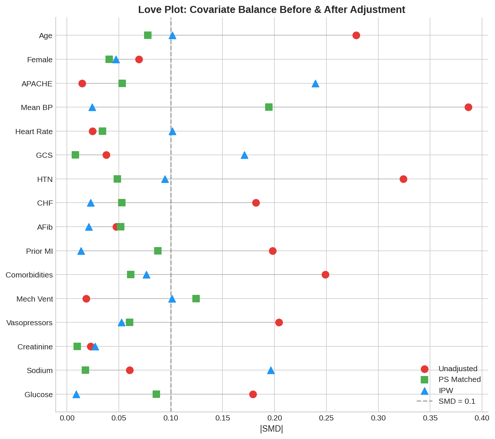

# CausalCare 🏥

### Estimating the Causal Effect of Early Beta-Blocker Administration on ICU Mortality Using Modern Causal Inference Methods

[](https://www.python.org/downloads/)
[](LICENSE)
[](https://physionet.org/content/eicu-crd-demo/2.0.1/)

---

## Key Finding

Naive (unadjusted) analysis suggests early beta-blocker use is associated with **1.8 percentage points lower** hospital mortality (7.0% vs 8.8%). However, **9 of 18 baseline covariates** show meaningful imbalance (SMD > 0.1) between treated and control groups — including mean blood pressure, hypertension history, prior MI, and total medication count — indicating substantial confounding that requires causal adjustment.

> ⚠️ **This project demonstrates causal inference methodology. Clinical decisions should not be based on these results.**

---

## Research Question

**Does early beta-blocker administration (within 24 hours of ICU admission) causally reduce hospital mortality in critically ill patients?**

This is a clinically relevant question with an established evidence base, making it ideal for demonstrating causal inference methods on observational EHR data.

## Causal DAG

<p align="center">
  
</p>

## Methods

| Method | Purpose |
|--------|---------|
| **Propensity Score Matching** | 1:1 nearest-neighbor matching with caliper |
| **Inverse Probability Weighting** | Stabilized weights with trimming |
| **Doubly Robust (AIPW)** | Consistent if either PS or outcome model is correct |
| **Double Machine Learning** | Cross-fitted, debiased ML estimator via EconML |
| **Causal Forest** | Heterogeneous treatment effect estimation (CATE) |
| **Sensitivity Analysis** | E-values, DoWhy refutation tests |

## Results

<p align="center">
  
</p>

## Dataset

**eICU Collaborative Research Database Demo v2.0.1** — openly available, no credentialing required.

- **2,520 ICU stays** across 186 hospitals (multi-center)
- **515 treated** (early beta-blocker) vs. **2,005 control**
- **212 mortality events** (8.4% overall)
- Rich confounders: APACHE scores, labs, comorbidities, concurrent treatments

## Pre-Matching Covariate Balance

| Variable | Treated | Control | SMD |
|----------|---------|---------|-----|
| Age | 67.0 ± 14.9 | 62.3 ± 18.3 | **0.279** |
| Mean BP (mmHg) | 94.9 ± 43.3 | 79.1 ± 41.0 | **0.376** |
| Hypertension | 58.3% | 42.2% | **0.324** |
| CHF History | 18.3% | 11.8% | **0.182** |
| Prior MI | 13.6% | 7.5% | **0.198** |
| Comorbidity Count | 2.1 ± 1.7 | 1.7 ± 1.7 | **0.249** |
| Vasopressors | 10.7% | 5.6% | **0.186** |
| Num Early Meds | 17.9 ± 9.1 | 6.5 ± 7.2 | **1.382** |

**Bold** = SMD > 0.1 (imbalanced). These confounders must be adjusted for.

<p align="center">
  
</p>

## Project Structure

```
CausalCare/
├── README.md
├── LICENSE
├── requirements.txt
├── .gitignore
├── src/
│   ├── __init__.py
│   └── cohort.py              # Cohort construction & feature engineering
├── notebooks/
│   ├── 01_cohort_and_dag.py   # Cohort description & causal framework
│   ├── 02_propensity_analysis.py  # PS estimation, matching, IPW
│   ├── 03_causal_estimation.py    # AIPW, DML, Causal Forest
│   └── 04_sensitivity_analysis.py # E-values & robustness checks
├── figures/                   # Generated plots (tracked in repo)
├── data/
│   ├── README.md              # Data access & download instructions
│   ├── raw/                   # eICU Demo CSVs (gitignored)
│   └── processed/             # Analysis-ready datasets (gitignored)
├── tests/
│   └── test_cohort.py         # Data integrity & pipeline tests
└── docs/
    └── methodology.md         # Detailed methods write-up
```

## Quick Start

```bash
# Clone
git clone https://github.com/skerk001/CausalCare.git
cd CausalCare

# Install dependencies
pip install -r requirements.txt

# Download eICU Demo (open access, ~30MB)
# See data/README.md for instructions

# Build analysis dataset
python src/cohort.py

# Run notebooks in order (from project root)
python notebooks/01_cohort_and_dag.py
python notebooks/02_propensity_analysis.py
python notebooks/03_causal_estimation.py
python notebooks/04_sensitivity_analysis.py

# Run tests
pytest tests/
```

## Requirements

```
pandas>=2.0
numpy>=1.24
scikit-learn>=1.3
statsmodels>=0.14
dowhy>=0.11
econml>=0.15
causalml>=0.15
matplotlib>=3.7
seaborn>=0.12
graphviz>=0.20
scipy>=1.11
```

## References

- Hernán MA, Robins JM. *Causal Inference: What If* (2020)
- Sharma & Kiciman. *DoWhy: An End-to-End Library for Causal Inference* (2020)
- Chernozhukov et al. *Double/Debiased Machine Learning* (2018)
- VanderWeele & Ding. *Sensitivity Analysis: Introducing the E-Value* (2017)
- Pollard et al. *The eICU Collaborative Research Database* (2018)

## License

MIT

## Citation

If you use this code in your research, please cite the eICU database:

```bibtex
@article{pollard2018eicu,
  title={The eICU Collaborative Research Database},
  author={Pollard, Tom J and Johnson, Alistair EW and Raffa, Jesse D and others},
  journal={Scientific Data},
  volume={5},
  pages={180178},
  year={2018}
}
```
